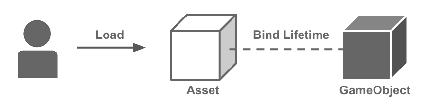
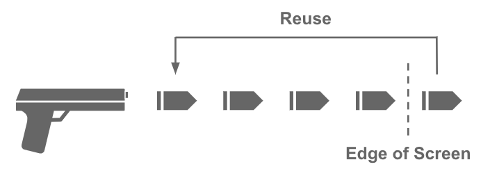
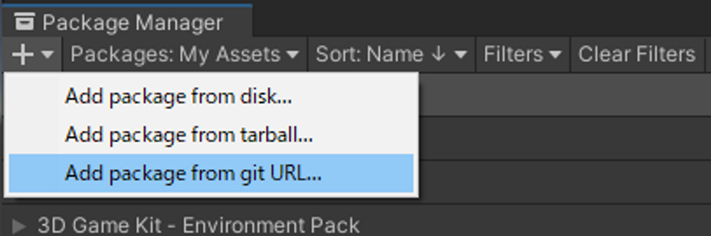

<h1 align="center">Addler</h1>

[](LICENSE.md)

[日本語ドキュメント(Japanese Documents Available)](README_JA.md)

Memory management system for Unity's Addressable Asset System.
Provides lifetime management system for loaded resources, object pooling system, and preloading system.

## Table of Contents

<!-- START doctoc generated TOC please keep comment here to allow auto update -->
<!-- DON'T EDIT THIS SECTION, INSTEAD RE-RUN doctoc TO UPDATE -->
<details>
<summary>Details</summary>

- [Overview](#overview)
- [Setup](#setup)
  - [Requirement](#requirement)
  - [Install](#install)
- [Lifetime Binding](#lifetime-binding)
  - [Bind to GameObject](#bind-to-gameobject)
  - [Bind to non-GameObject](#bind-to-non-gameobject)
- [Preloading](#preloading)
  - [How to use Preloader](#how-to-use-preloader)
  - [Use Preloader with Lifetime Binding](#use-preloader-with-lifetime-binding)
  - [Limitations of Preloader](#limitations-of-preloader)
- [Object Pooling](#object-pooling)
  - [How to use Object Pooling](#how-to-use-object-pooling)
  - [Use Object Pool with Lifetime Binding](#use-object-pool-with-lifetime-binding)
- [Other](#other)
  - [Disable Preloading / Object Pooling](#disable-preloading--object-pooling)
  - [Use UniTask](#use-unitask)
- [Licenses](#licenses)

</details>
<!-- END doctoc generated TOC please keep comment here to allow auto update -->

## Overview
In the Addressable Asset System, you need to explicitly release the loaded resources when they are no longer needed.

```cs
// Load.
var handle = Addressables.LoadAssetAsync<GameObject>("FooPrefab");
await handle.Task;

// Release.
Addressables.Release(handle);
```

If you forget to release, it can cause memory leaks and serious problems such as application crashes.
However, such an implementation is easy to forget to release, and it is difficult to notice when you forget it.

**Addler** solves this problem by binding the lifetime of the loaded resource to a **GameObject**, for example, as follows.
When the associated **GameObject** is destroyed, the resource is automatically released.

```cs
var fooObj = new GameObject();

// Load and bind the lifetime of the resource to fooObj.
// The asset will be released at the same time the fooObj is destroyed.
Addressables.LoadAssetAsync<GameObject>("BarPrefab").BindTo(fooObj);
```

In the above code, the resource is released as soon as the **fooObj** is destroyed.

<p align="center">
  
</p>

**Addler** also provides Preloading feature that preloads resources and gets them synchronously, and Object Pooling feature that pools prefab instances and uses them.

<p align="center">
  
</p>

Further, you can bind these lifetimes to **GameObjects** and so on to prevent forgetting to release them.

Thus, **Addler** is a library for proper memory management of resources in **Addressable***.

## Setup

### Requirement
* Unity 2020.3 or higher.
* Addressables is installed.

### Install
1. Open the Package Manager from Window > Package Manager
2. "+" button > Add package from git URL
3. Enter the following
   - https://github.com/Haruma-K/Addler.git?path=/Assets/Addler

<p align="center">
  
</p>

Or, open Packages/manifest.json and add the following to the dependencies block.

```json
{
   "dependencies": {
      "com.harumak.addler": "https://github.com/Haruma-K/Addler.git?path=/Assets/Addler"
   }
}
```

If you want to set the target version, specify it like follow.

- https://github.com/Haruma-K/Addler.git?path=/Assets/Addler#1.0.0

## Lifetime Binding
One of Addler's basic features is lifetime binding.
This binds the lifetime of the resource to **GameObject** and so on, to release it automatically and reliably.

### Bind to GameObject
To bind the lifetime of the resource to **GameObject**, use the **BindTo** method as follows.

```cs
// Load the resource and bind the lifetime to gameObject.
var handle = Addressables
    .LoadAssetAsync<GameObject>("FooPrefab")
    .BindTo(gameObject);
await handle.Task;
var prefab = handle.Result;

// Destroy gameObject and release the resource.
Destroy(gameObject);
```

Now, the resource is released as soon as the gameObject is destroyed.

### Bind to non-GameObject
You can bind the lifetime to non-GameObject as well.
To do so, create a class that implements `IReleaseEvent` interface and pass it to `BindTo` method.

**Addler** provides the implementation of `IReleaseEvent` for the ParticleSystem.
As the example of `IReleaseEvent` implementation, show it below.

```cs
using System;
using Addler.Runtime.Core.LifetimeBinding;
using UnityEngine;

[RequireComponent(typeof(ParticleSystem))]
public sealed class ParticleSystemBasedReleaseEvent : MonoBehaviour, IReleaseEvent // Implement IReleaseEvent
{
    [SerializeField] private ParticleSystem particle;
    private bool _isAliveAtLastFrame;

    private void Awake()
    {
        if (particle == null)
            particle = GetComponent<ParticleSystem>();
    }

    private void Reset()
    {
        particle = GetComponent<ParticleSystem>();
    }

    private void LateUpdate()
    {
        var isAlive = particle.IsAlive(true);
        if (_isAliveAtLastFrame && !isAlive)
            ReleasedInternal?.Invoke();

        _isAliveAtLastFrame = isAlive;
    }
    
    event Action IReleaseEvent.Dispatched
    {
        add => ReleasedInternal += value;
        remove => ReleasedInternal -= value;
    }

    private event Action ReleasedInternal;
}
```

## Preloading
In Addressable Asset System, resources are loaded asynchronously.

```cs
// Asynchronous loading
var handle = Addressables.LoadAssetAsync<GameObject>("fooPrefab");
await handle.Task;
```

However, in some cases, you want to get pre-loaded resources synchronously.
You can do this with preloader.

### How to use Preloader
The preloading feature is provided by the **Preloader** class.
Below is an example of how to use it.

```cs
using System;
using System.Collections;
using Addler.Runtime.Core.Preloading;
using UnityEngine;

public sealed class Example : MonoBehaviour
{
    private IEnumerator PreloadExample()
    {
        var preloader = new AddressablePreloader();

        // Preload
        {
            var progress = new Progress<float>(x => Debug.Log($"Progress: {x}"));
            
            // Preload by address.
            yield return preloader.PreloadKey<GameObject>("fooAddress", progress);

            // You can also preload by label.
            yield return preloader.PreloadKey<GameObject>("fooLabel", progress);

            // You can also preload multiple keys at once.
            yield return preloader.PreloadKeys<GameObject>(new[] { "barAddress", "bazAddress" }, progress);
        }

        // Get the preloaded object.
        {
            // Get by address.
            preloader.GetAsset<GameObject>("fooAddress");

            // Get multiple assets by label.
            preloader.GetAssets<GameObject>("fooLabel");
        }
        
        // Dispose the preloader and release all the assets.
        preloader.Dispose();
    }
}
```

You can preload resources of the keys in the argument by calling `AddressablePreloader.PreloadKey()/PreloadKeys()`.
And you can get the preloaded resources synchronously by `AddressablesPreloader.GetAsset()` method.

And all resources are released by `AddressablePreloader.Dispose()` method.

### Use Preloader with Lifetime Binding
You can also bind the lifetime of the preloader.

```cs
// Bind the lifetime of the preloader to the GameObject.
// When gameObject is destroyed, the preloader will be disposed and release all the assets.
var preloader = new AddressablePreloader().BindTo(gameObject);
```

All resources will be released when the preloader lifetime expires.

### Limitations of Preloader
As a rule for preloading, the "key type specified at preloading" and the "key type specified when retrieving the preloaded resource" must match.

For example, if label A, which contains the assets at address A, is specified at the time of preloading, label A must also be specified at the time of retrieving.
It is not possible to specify address A.

This is because, due to the specification of Addressable Asset System, there is no way to synchronously retrieve the key (Primary Key) pointed to by the address, label, or AssetReference.

If you want to support this case, you can use [Synchronous Workflow](https://docs.unity3d.com/Packages/com.unity.addressables@1.21/manual/SynchronousAddressables.html) that is added in Addressable Asset System 1.17.1.
However, this feature waits synchronously until all running **AsyncOperations** are finished, so be careful when using it.

## Object Pooling
Unity uses manu GAmeObjects instantiated from Prefabs.
However, instantiating and destroying is expensive, so they often cause performance problems.

In cases where many instances of the same Prefab are created, such as bullets, it is possible to prevent performance degradation by creating a certain number of instances in advance and using them.
This is called object pooling.

<p align="center">
  
</p>

### How to use Object Pooling
The preloading feature is provided by the `AddressablePool` class.
Below is an example of how to use it.

```cs
using System;
using System.Collections;
using Addler.Runtime.Core.Pooling;
using UnityEngine;

public sealed class Example : MonoBehaviour
{
    private IEnumerator PoolExample()
    {
        // Create a new pool with key of the GameObject.
        var pool = new AddressablePool("fooPrefab");

        // Create instances in the pool.
        var progress = new Progress<float>(x => Debug.Log($"Progress: {x}"));
        yield return pool.Warmup(5, progress);

        // Get an instance from the pool.
        var pooledObject = pool.Use();
        var instance = pooledObject.Instance;

        // Return the instance to the pool.
        pool.Return(pooledObject);
        //pooledObject.Dispose(); // You can also return the instance by disposing the pooled object.

        // Destroy the pool and release all instances.
        pool.Dispose();
    }
}
```

When you call `AddressablePool.WarmupAsync()`, as many instances of prefab as you pass in the argument will be created.
To get an instance from the pool, use the `AddressablePool.Use()` method to get the `PooledObject`.
You can get an instance from the `Instance` property of this.
To return the instance to the pool, call `AddressablePool.Return()` or `PooledObject.Dispose()`.

When the pool is no longer needed, call `AddressablePool.Dispose()`.
All instances will be destroyed and the resources will be released.

### Use Object Pool with Lifetime Binding
You can also bind the lifetime of the object pool and the lifetime of instances retrieved from it.

```cs
using System.Collections;
using Addler.Runtime.Core.Pooling;
using UnityEngine;

public sealed class Example : MonoBehaviour
{
    private IEnumerator PoolExample()
    {
        // Bind the lifetime of the pool to GameObject.
        // If gameObject1 is destroyed, the pool will be disposed.
        var pool = new AddressablePool("FooPrefab")
            .BindTo(gameObject1);

        yield return pool.Warmup(5);

        // Bind the lifetime of the instance to GameObject.
        // If gameObject2 is destroyed, the instance will be returned to the pool.
        var instance = pool
            .Use()
            .BindTo(gameObject2)
            .Instance;
    }
}
```

When the lifetime of an instance expires, it will be returned to the pool.
When the lifetime of the object pool expires, all instances will be destroyed and released.

## Other

### Disable Preloading / Object Pooling
If you do not use Preloading or Object Pooling, you can disable them and exclude them from the compilation.
To disable them, set the following **Scripting Define Symbols** in the **Player Settings**.

- **ADDLER_DISABLE_PRELOADING** : Disable Preloading.
- **ADDLER_DISABLE_POOLING** : Disable Object Pooling.

### Use UniTask
In Preloading / Object Pooling, you can use coroutine to wait for the asynchronous operation.
You can use UniTask too 

1. Install [UniTask](https://github.com/Cysharp/UniTask).（There are several ways to install.）
2. (Only if you install 1. not via Package Manager) Add `ADDLER_UNITASK_SUPPORT` to **Scripting Define Symbols** and restart Unity.
3. Now you can use the **UniTask** version methods such as `AddressablePool.WarmupAsync`.

## Licenses
This software is released under the MIT License. You are free to use it within the scope of the license, but the following copyright and license notices must be displayed when using it.

* [LICENSE.md](LICENSE.md)

In addition, the table of contents of this document was created using the following software

* [toc-generator](https://github.com/technote-space/toc-generator)

See [Third Party Notices.md](Third%20Party%20Notices.md) for details on these licenses.
